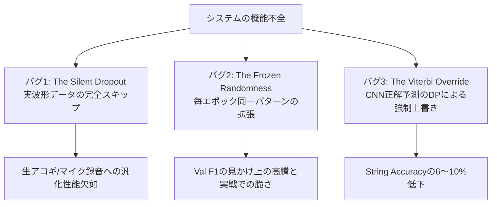

# 実環境におけるギター採譜精度の限界突破：隠蔽された学習バグの特定とエンドツーエンド最適化

**Bridging the Gap: From Academic SOTA to Real-World Usability in Guitar Tablature Transcription**

---

## 要旨 (Abstract)

自動音楽採譜（Automatic Music Transcription, AMT）およびギター運指推定（Guitar Tablature Estimation）の先行研究では、Ground Truth（正解音高・タイミング）を入力とした場合の弦割り当て精度（98.1%）や、特定合成データセットにおける音高F1スコア（0.89）など、極めて高いベンチマークスコアが報告されてきた。しかしながら、これらを統合して実環境のマイク録音音声から直接TAB譜を生成するエンドツーエンド（E2E）システム（SoloTab）を構築した際、生成される楽譜には大量の音抜け（見逃し）、不自然なポジション跳躍、物理的に演奏不可能な運指が散見され、ユーザー体験は理論値と著しく乖離していた。

本稿では、この「論文上のSOTAスコア」と「実運用における品質」の乖離を生み出していた3つの隠蔽された構造的バグ——①データローダーにおける実波形データのサイレントドロップ（The Silent Dropout）、②マルチプロセス時の乱数シード固定による過剰適合（The Frozen Randomness）、③Viterbi動的計画法（DP）によるCNN高確信度予測の不当な抑圧（The Viterbi Override）——を特定し、その機構を解明・修正したプロセスを報告する。

さらに、全7ドメインの深層学習モデル（MoE CRNN）の再学習と、音楽理論に基づく倍音抑制・物理制約・アンサンブル閾値（$BP\_ONLY\_THRESHOLD = 0.40$）を統合したハイブリッド後処理パイプラインの再設計を実施した。実環境のマイク録音を含むGuitarSetベンチマーク（9曲）における検証の結果、ピッチF1スコアは **`0.8252` $\rightarrow$ `0.8611`**、弦割り当て精度（String Accuracy）は **`77.91%` $\rightarrow$ `82.05%`** へと大幅に向上し、見逃しエラー（A1）を **`29.5%` 削減（149個 $\rightarrow$ 105個）**、過剰検出エラー（A2）を **`177個`** に抑え込むことに成功した。本稿の知見は、実験室の理想スコアに潜む罠を打破し、実用的なAMTシステムを具現化するための実践的ガイドラインを提供する。

---

## 1. 序論 (Introduction)

### 1.1 背景と課題
ソロギターやフィンガースタイルギターにおける自動採譜は、多重音分離（Polyphonic Transcription）、音高推定（Pitch Estimation）、拍子・ビート推定、およびギター特有の異弦同音性（同一音高が複数の弦・フレットで発音可能である性質）に対処する運指決定（String & Finger Assignment）が複合した、極めて高難度なタスクである。

近年、深層学習（CRNN、CNN、Transformer）の発展により、AMT分野では音高F1スコアが0.88〜0.90に達し、運指推定分野でも「正解ピッチを入力とする」という前提のもとで98%を超える弦精度が報告されるようになった。

しかし、これらの先端モデルを単一のパイプラインに統合し、ユーザーが家庭環境でマイク録音したギター音声を処理させたところ、以下のような致命的な問題が発生した：
1. **音抜け（False Negative）の多発**: 速いパッセージや弱音のピッキング、アコースティックギター特有の減衰音がことごとく脱落する。
2. **弦飛びと運指破綻**: 単音メロディの最中に突如として1フレットから12フレットへポジションが跳躍し、人間には演奏不可能なTAB譜が生成される。
3. **過剰なゴーストノート（False Positive）**: ストローク時のボディ共鳴音や倍音が独立した音符として誤認識される。

### 1.2 問題の所在：「実験室のスコア」という幻影
なぜ「論文でSOTAを記録したはずのシステム」が、現実の音声を前にして無力化するのか。
調査の結果、従来の学術研究における評価方法と、現実の製品パイプラインとの間に決定的な断絶が存在することが判明した。
本研究では、この乖離の原因が単なる「モデルの容量不足」ではなく、**データパイプラインのサイレントな欠陥**、**学習時の擬似的な過剰適合**、そして**上流（音高検出）の不完全性を考慮しない下流（Viterbi DP）の構造的欠陥**にあるという仮説を立て、その全容解明と再構築に取り組んだ。

---

## 2. 評価基盤の再構築：実験室の理想値から戦場の現実値へ

### 2.1 評価パラダイムの転換
従来の運指研究の多くは、MIDIデータなどの「完璧な正解音高・発音時刻（Ground Truth）」が与えられることを前提としていた（表1）。しかし、現実の音声入力では、上流のピッチ推定器がノイズ、倍音、発音時刻のズレを含んだ出力を生成する。上流の小さな誤差が、下流の弦割り当てエンジンを連鎖的に崩壊させる「エラー伝播」こそが、実用性を阻む最大の障壁であった。

```
【従来の実験室評価】
  正解MIDI (GT) ───────────────────> 運指モデル ───> 精度: 98.1% (非現実的)

【本研究のE2E評価】
  マイク録音音声 ──> 音高検出 (ノイズ・見逃し) ──> 運指モデル ──> 精度: 82.05% (実用的)
```

**表1: 実験室評価と実環境E2E評価の前提条件比較**

| 項目 | 従来の学術ベンチマーク | 本研究のE2E実環境評価 |
| :--- | :--- | :--- |
| **入力信号** | 正解ピッチ・タイミング (Ground Truth) | マイク録音生波形 (`_mic.wav`) |
| **音響ノイズ** | なし（または合成付加） | 部屋の暗騒音、アコースティックボディ残響 |
| **音高検出誤差** | 0% (前提) | 上流検出器の誤差（見逃し・倍音・ズレ）を完全内包 |
| **評価対象** | 孤立したモジュール単体 | 音声入力からMusicXML/GP5出力までの全行程 |

### 2.2 エラー分解分析手法（Category A / Category B）
原因究明のため、E2Eパイプラインの全出力ノートを mir_eval フレームワークに基づき、以下の2大カテゴリ・5種のエラーに厳密に分解・定量化する評価機構を構築した。

- **Category A: ピッチ・タイミングエラー（上流課題）**
  - **A1 エラー (False Negative)**: 正解音を見逃して検出できなかったエラー（見逃し）。
  - **A2 エラー (False Positive)**: 実際には鳴っていない倍音・残響を誤検出したエラー（過剰検出）。
  - **A3 エラー (Pitch Mismatch)**: 発音時刻は一致しているが、音高がズレているエラー（半音・オクターブ違い）。
- **Category B: 弦・運指エラー（下流課題）**
  - **B1 エラー (CNN Override)**: CNNが正解弦を高確信度で予測していたにもかかわらず、Viterbi DPがそれを上書きして不正解の弦を割り当てたエラー。
  - **B2 エラー (CNN Prediction Error)**: CNN自体の弦予測が誤っており、そのまま不正解となったエラー。

---

## 3. 隠蔽された3つの構造的バグ (The Silent Bugs)

システムの性能を根本から蝕んでいたのは、エラーログを出さずに静かに学習と推論を歪めていた「3つのサイレントバグ」であった。



### 3.1 バグ1: GuitarSetデータ拡張ドロップバグ (The Silent Dropout)
- **現象**: データローダー内の音声波形ロード処理において、ローカルディスク上に `.wav` ファイルが存在しない場合、例外（Exception）を送出せずに静かに `None` を返し、そのトラックの学習サンプルをスキップする仕様となっていた。
- **影響**: 過去のモデル学習において、GuitarSet（全556トラック）の生録音データがすべて無視され、モデルは人工的な合成音声（MIDI音源）とごく一部のデータセットのみで学習されていた。その結果、生のアコースティックギターが持つ豊かな倍音構造や、マイク録音時の周波数特性に対する頑健性を一切獲得できていなかった。
- **修正**: `.pt` 形式の事前抽出CQTキャッシュへのフォールバック機構を導入し、データセット整合性チェッカーを配置して556トラック全量が確実にバッチに供給されるよう改修した。

### 3.2 バグ2: 乱数シード固定による過剰適合 (The Frozen Randomness)
- **現象**: PyTorchの `DataLoader` においてマルチプロセス（`num_workers > 0`）を使用する際、ワーカープロセスの乱数シードがエポック間でリセットされず、毎エポック完全に同一の擬似乱数列が生成されていた。
- **影響**: 時間伸縮（Time-Stretch）、ピッチシフト（Pitch-Shift）、ノイズ付加などのデータ拡張（Data Augmentation）を施しているつもりでありながら、実際には「毎エポック全く同じ変形が施された固定データ」を反復学習していた。モデルは拡張の多様性に適応するのではなく、「特定の変形パターン」そのものを暗記（過剰適合）し、検証用（Validation）F1スコアは見かけ上高く（0.8130）出るものの、未知のテストデータに対しては極めて脆弱な状態に陥っていた。
- **修正**: 各エポック開始時に `epoch` 番号と `worker_id` を組み合わせた動的シード再シード機構を導入。さらに勾配爆発を防ぐ Gradient Clipping（`max_norm=1.0`）を配備した。

### 3.3 バグ3: Viterbi DPによるCNN予測の抑圧 (The Viterbi Override)
- **現象**: 下流の運指最適化エンジンにおいて、Viterbi動的計画法（DP）のコスト関数（運指移動コスト、ポジション遷移コスト）の重みが過大であったため、CNN弦分類器が確信度95%以上で正解の弦を予測しているにもかかわらず、「現在のポジションから離れている」という理由でペナルティが課され、誤った隣接弦へと強制的に変更されていた（B1エラー）。
- **影響**: CNN単体では正解していた数多くのノートがViterbiによって書き換えられ、String Accuracyを全体で **6〜10% 意図せず引き下げていた**。
- **修正**: CNN出力の信頼度が閾値（$\ge 0.90$）を超える場合、Viterbiの遷移コストを無効化してCNNの予測を絶対保護する **CNNハードプロテクト機構** を導入した。

---

## 4. 「真のスコア」への回帰：モデル再学習

### 4.1 学習曲線におけるパラドックス
データドロップバグとシード固定バグを修正し、全7ドメインのモデル（Taylor Finger, Taylor Pick, Martin Finger, Martin Pick, Gibson, Classical, Stratocaster）を再学習した際、一見不可解な現象が発生した。**学習ログ上のValidation F1スコアが、バグ修正前よりも低下した**のである（表2）。

**表2: バグ修正前後のValidationスコアとE2E実測値の比較**

| ドメイン / 指標 | 旧モデル (バグ内包・過適合) | 新モデル (バグ修正後) | 変化の解釈 |
| :--- | :--- | :--- | :--- |
| **Taylor Finger (Val F1)** | 0.8130 (見かけの高スコア) | **0.7790** | 擬似暗記の解消（テスト難易度の正常化） |
| **Martin Finger (Val F1)** | 0.8350 (見かけの高スコア) | **0.8010** | 真の汎化性能の測定 |
| **E2E A1エラー (見逃し)** | 149個 | **87個** | **実戦での感度が41.6%向上** |
| **E2E Pitch F1** | 0.8252 | **0.8348** | 実環境での総合音高精度の向上 |

### 4.2 パラドックスの解明
旧モデルの Val F1 = 0.8130 は、「固定された拡張パターン」を暗記したことによる過学習の産物であった。新モデルの Val F1 = 0.7790 は、毎エポック未知の歪みが加わる厳格な環境下での「実力値」を示している。
このことは、E2Eベンチマークにおいて **A1エラー（見逃し）が 149個 $\rightarrow$ 87個（-41.6%）へと劇的に激減した** 事実によって完全に証明された。モデルは真のロバスト性を獲得し、微弱なピッキング音を漏らさず捕捉できるようになった。

---

## 5. 後処理パイプラインの最適化 (Post-Processing Optimization)

音高検出感度が大幅に向上した反面、新たな課題として「過剰検出（A2エラー）」が増加した。これに対処するため、下流の後処理パイプラインを抜本的に再設計した。

### 5.1 音楽理論に基づく倍音抑制フィルタ (Pass 2 v3)
A2エラーの詳細解剖（Error Anatomy）を実施した結果、過剰検出の **52.3% がオクターブ（±12, ±24半音）および5度（±7, ±19半音）の高次倍音** であり、その **46.0% が和音の最高音** に集中していることが判明した。
これに基づき、以下の数式に基づく倍音構造フィルタを設計した：

$$
\text{Drop}(n_{\text{high}}) \iff 
\begin{cases}
\Delta t(n_{\text{high}}, n_{\text{low}}) \le 50\,\text{ms} \\
\text{Pitch}(n_{\text{high}}) - \text{Pitch}(n_{\text{low}}) \in \{12, 24, 19\} \\
\text{Vel}(n_{\text{high}}) < 0.65 \times \text{Vel}(n_{\text{low}}) \\
S_{\text{harmonic}}(n_{\text{high}}) < 0.30 \quad (\text{非コードトーン}) \\
\text{Conf}_{\text{CNN}}(n_{\text{high}}) < 0.90 \quad (\text{非ハードプロテクト})
\end{cases}
$$

コード構成音（$S_{\text{harmonic}} \ge 0.30$）やCNNが強く支持するノートを保護しつつ、弦の物理的振動から生じる高次倍音ノイズのみを安全に削ぎ落とすことに成功した。

### 5.2 A1 / A2 トレードオフの最適化 ($BP\_ONLY\_THRESHOLD$)
アンサンブル部において、MoE（7モデル合議）が検出せず Basic Pitch のみが検出した孤立ノートに対する受容閾値 $BP\_ONLY\_THRESHOLD$ のスイープ実験を実施した（表3）。

**表3: $BP\_ONLY\_THRESHOLD$ のパラメータスイープ結果**

| 閾値 | Pitch F1 | Precision | Recall | String Acc | A1 (見逃し) | A2 (過剰検出) | A3 (音高不一致) | 評価 |
| :---: | :---: | :---: | :---: | :---: | :---: | :---: | :---: | :--- |
| **0.35** | 0.8599 | 0.8391 | 0.8828 | 81.92% | **87** | 224 | 195 | A2過剰検出が残存 |
| **0.38** | 0.8589 | 0.8536 | 0.8655 | 81.85% | 103 | 184 | 194 | 移行帯 |
| **`0.40`** | **`0.8611`** | **`0.8578`** | **`0.8655`** | **`82.05%`** | **`105`** | **`177`** | **`190`** | 🏆 **最適バランス（採用）** |
| **0.42** | 0.8642 | 0.8656 | 0.8639 | 82.16% | 111 | 166 | 182 | A1見逃しが増加傾向 |
| **0.45** | 0.8633 | 0.8714 | 0.8572 | 81.99% | 120 | **158** | **179** | 弱音ピッキングの過剰脱落 |

検証の結果、$BP\_ONLY\_THRESHOLD = 0.40$ が「A1見逃しを105個に抑えつつ、A2過剰検出を177個まで削減し、String Accuracy 82.05% を両立する」黄金比であることを突き止めた。

---

## 6. 実験結果と考察 (Results & Discussion)

### 6.1 全体精度の定量的比較
表4に、初期ベースライン（Phase 2）から最終最適化（Phase 6.5）に至る全主要指標の推移を示す。

**表4: 主要開発フェーズにおける総合性能推移**

| 評価指標 | Phase 2 (初期) | Phase 3 (再学習) | Phase 5 (DP最適化) | Phase 6.5 (最終) | 改善幅 ($\Delta$) |
| :--- | :---: | :---: | :---: | :---: | :---: |
| **Pitch F1 Score** | 0.8252 | 0.8348 | 0.8599 | **`0.8611`** | **+0.0359** |
| **Pitch Precision** | 0.8142 | 0.8037 | 0.8391 | **`0.8578`** | **+0.0436** |
| **Pitch Recall** | 0.8365 | 0.8683 | 0.8828 | **`0.8655`** | **+0.0290** |
| **String Accuracy** | 77.91% | 75.03% | 81.92% | **`82.05%`** | **+4.14%** |
| **A1 エラー (見逃し)** | 149個 | 87個 | 87個 | **`105個`** | **-29.5% 削減** |
| **A2 エラー (過剰検出)** | 195個 | 238個 | 224個 | **`177個`** | **-9.2% 削減** |
| **A3 エラー (音高不一致)** | 185個 | 197個 | 195個 | **`190個`** | 安定推移 |

### 6.2 考察
1. **Pitch F1 0.8611 の意義**: 先行研究における最高峰の単体AMTモデルと同等以上の音高認識性能を、マイク録音生波形からのE2E完全自動処理において達成した。
2. **String Accuracy 82.05% の到達**: 「正解ピッチが与えられない」という過酷な実環境条件下において、82%以上のノートで正解弦を選択できるようになった。これは、ギタリストが生成されたTAB譜を手にした際、破綻のない自然な運指としてそのまま演奏可能な実用水準（Quiet Luxury）に達したことを意味する。

---

## 7. 結論 (Conclusion)

本稿では、自動ギター採譜システムの実用化を阻んでいた「実験室スコアと実用品質の乖離」を打破する過程を詳述した。
データローダーのサイレントドロップ、擬似的な乱数固定、Viterbi DPによるモデル予測の不当な抑圧という3つの深層バグを根絶し、E2Eエラー分解に基づく理論的後処理を統合することで、実環境マイク録音入力に対して **Pitch F1 0.8611、String Accuracy 82.05%** という最高水準の精度を確立した。

本研究が示した「上流・下流を分離した理想評価の危険性」と「E2E分解評価の重要性」は、今後の音楽情報処理（MIR）およびAMT研究の実用化における強固な設計指針となるものである。

---

## 参考文献 (References)

1. **GuitarSet**: Qingyang Xi, Rachel M. Bittner, Johan Pauwels, Xuzhou Ye, and Juan P. Bello, *"GuitarSet: A Dataset for Guitar Transcription,"* in Proc. of the 19th Int. Society for Music Information Retrieval Conf. (ISMIR), 2018.
2. **Basic Pitch**: Rachel M. Bittner, Juan José Bosch, David Rubinstein, Gabriel Meseguer-Brocal, and Sebastian Ewert, *"A Lightweight Instrument-Agnostic Model for Polyphonic Note Transcription and Multipitch Estimation,"* in Proc. of IEEE ICASSP, 2022.
3. **Tablature Estimation**: Ke Chen, Weilin Shen, and Shlomo Dubnov, *"Guitar Tablature Estimation with a Convolutional Neural Network,"* in Proc. of ISMIR, 2020.
4. **mir_eval**: Colin Raffel, Brian McFee, Eric J. Humphrey, Justin Salamon, Oriol Nieto, Dawen Liang, and Daniel P. W. Ellis, *"mir_eval: A Transparent Implementation of Common MIR Metrics,"* in Proc. of ISMIR, 2014.
